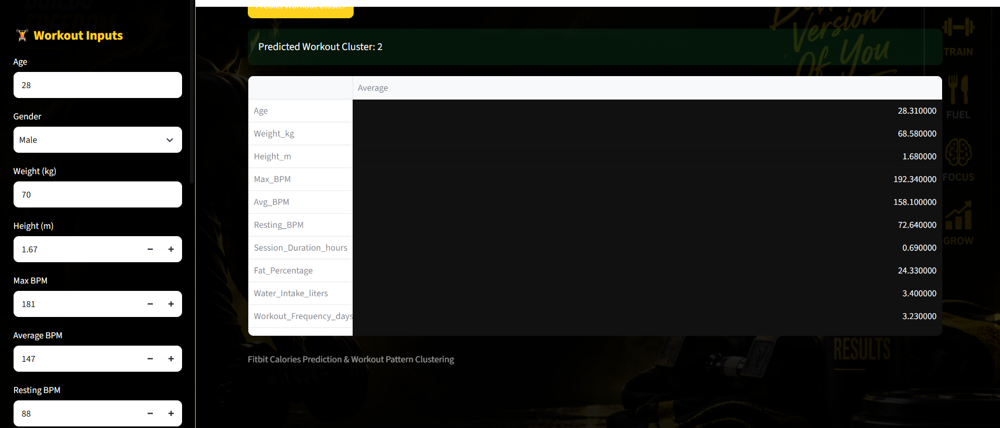
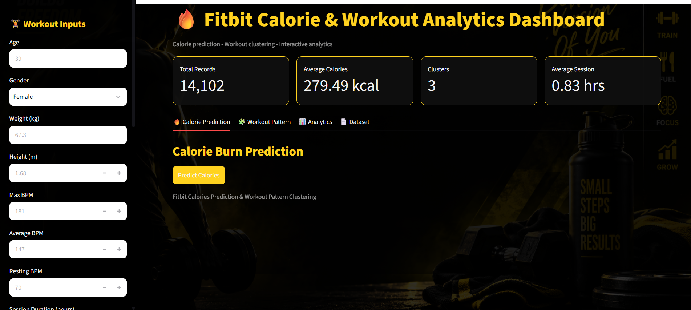
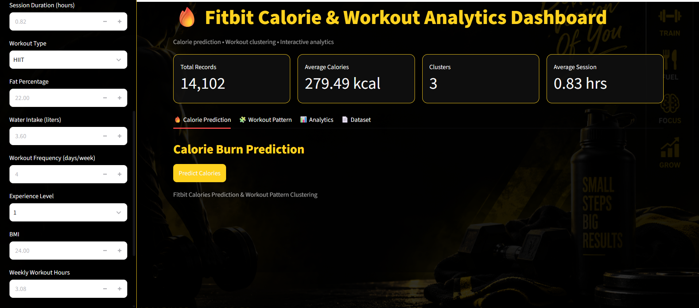

#  Fitbit Calorie Burn Prediction & Workout Pattern Clustering

Predicts calories burned in a workout session and groups workouts into behavioral patterns using unsupervised clustering — built on Fitbit fitness-tracker data.

**Domain:** Fitness Analytics / Health Tech / Machine Learning

---

## Overview

This project has two machine learning components wrapped in one interactive Streamlit dashboard:

1. **Calorie Burn Prediction (Regression)** — estimates calories burned in a workout session from physiological and workout inputs (age, weight, heart rate, session duration, workout type, etc.)
2. **Workout Pattern Clustering (Unsupervised Learning)** — groups workouts into behavioral clusters (e.g. long-session/frequent vs. high-heart-rate vs. moderate activity) using K-Means, without using the workout type as a label.

## Dashboard Preview

The Streamlit app has four tabs:

| Tab | What it does |
|---|---|
| 🔥 Calorie Prediction | Enter your workout details in the sidebar and predict calories burned |
| 🧩 Workout Pattern | Predict which behavioral cluster your workout belongs to and compare it against the cluster average |
| 📊 Analytics | Interactive charts — cluster distribution, calories by cluster, duration vs. calories, workout type split |
| 📄 Dataset | Preview and download the full clustered dataset |

## Screenshots

<table>
<tr>
<td width="50%">

**Dashboard Overview — Calorie Prediction**
<br/>
KPI summary (total records, average calories, clusters, average session) with the calorie prediction tab active.



</td>
<td width="50%">

**Workout Inputs Panel**
<br/>
Sidebar inputs used to describe a workout session (age, gender, weight, height, heart-rate metrics, and more) before running a prediction.



</td>
</tr>
<tr>
<td colspan="2">

**Workout Pattern Clustering Result**
<br/>
K-Means assigns the entered workout to a cluster and shows the cluster's average profile for comparison.



</td>
</tr>
</table>

## Project Structure

```
fitbit_calories_prediction/
├── assets/
│   └── screenshots/          # Dashboard screenshots used in this README
├── data/
│   ├── raw/                 # Original Fitbit dataset
│   │   └── Fitbit_dataset.csv
│   └── processed/           # Cleaned & feature-engineered data
│       ├── Fitbit_cleaned.csv
│       └── Fitbit_feature_engineered.csv
├── notebooks/
│   ├── data_cleaning.ipynb          # Missing values, duplicates, type fixes
│   ├── EDA.ipynb                    # Exploratory data analysis
│   ├── Feature_Engineering.ipynb    # BMI/fat categories, derived features
│   ├── model_building.ipynb         # Regression models + K-Means clustering
│   ├── tuned_xgboost_calorie_model.pkl   # Final regression model
│   ├── cluster_scaler.pkl                # StandardScaler used for clustering
│   ├── workout_kmeans_model.pkl          # Final K-Means model
│   └── workout_clustered_data.csv        # Dataset with cluster labels
├── streamlit/
│   ├── app.py                # Dashboard application
│   └── background.png        # Dashboard background image
└── Fitbit ... .pdf           # Project brief
```

## Methodology

1. **Data Cleaning** — handled missing values, duplicates, and inconsistent types on the raw Fitbit dataset.
2. **EDA** — explored distributions and relationships between physiological metrics, workout type, and calories burned.
3. **Feature Engineering** — derived features such as BMI Category and Fat Category, and prepared the modeling feature set.
4. **Regression Modeling** — trained and compared six models to predict `Calories_Burned_kcal`, then tuned the best one.
5. **Clustering** — scaled 12 numerical workout/physiological features and applied K-Means (k chosen via the elbow method) to segment workouts into behavioral patterns, independent of workout type.

## Model Performance

Regression models compared (test set):

| Model | MAE | RMSE | R² Score |
|---|---|---|---|
| **XGBoost (tuned)** | **3.19** | **5.09** | **0.9992** |
| XGBoost | 3.77 | 5.85 | 0.9989 |
| Random Forest | 3.88 | 8.68 | 0.9976 |
| Decision Tree | 8.51 | 14.82 | 0.9930 |
| KNN Regression | 33.39 | 48.89 | 0.9239 |
| Linear Regression | 34.63 | 52.81 | 0.9112 |
| SVR | 46.94 | 81.25 | 0.7897 |

The tuned XGBoost Regressor was selected as the final model (best cross-validation R² of 0.9985, hyperparameters: `learning_rate=0.05, max_depth=6, n_estimators=200, subsample=0.8`).

**Clustering:** K-Means with **k = 3** clusters, trained on 12 scaled features (age, weight, height, heart-rate metrics, session duration, fat %, water intake, workout frequency, BMI, weekly workout hours). Cluster count chosen via the elbow method on inertia.

## Tech Stack

- **Language:** Python
- **Data Processing:** Pandas, NumPy
- **Modeling:** Scikit-learn, XGBoost
- **Dimensionality Reduction / Clustering:** PCA, K-Means
- **Visualization:** Matplotlib, Plotly
- **App/Dashboard:** Streamlit
- **Model Persistence:** Joblib

## How to Run Locally

```bash
# 1. Clone the repository
git clone https://github.com/sanjay-prakash0706/fitbit_calories_prediction.git
cd fitbit_calories_prediction

# 2. Install dependencies
pip install pandas numpy scikit-learn xgboost joblib streamlit plotly matplotlib

# 3. Launch the dashboard
streamlit run streamlit/app.py
```

The app expects the trained model files (`tuned_xgboost_calorie_model.pkl`, `cluster_scaler.pkl`, `workout_kmeans_model.pkl`) and `workout_clustered_data.csv` inside the `notebooks/` folder — these are already included in this repo.

## Key Learnings

- Data preprocessing & feature engineering for real-world fitness-tracker data
- Supervised learning (regression) for continuous target prediction
- Unsupervised learning (K-Means clustering) for pattern discovery without labels
- Model evaluation using MAE, RMSE, and R²
- Business interpretation of ML results (translating clusters into readable "workout pattern" labels)
- Building and styling an interactive multi-tab Streamlit dashboard

## Author

**Sanjay Prakash R**
- GitHub: [sanjay-prakash0706](https://github.com/sanjay-prakash0706)
- LinkedIn: [sanjay-prakash-540aab372](https://linkedin.com/in/sanjay-prakash-540aab372)
